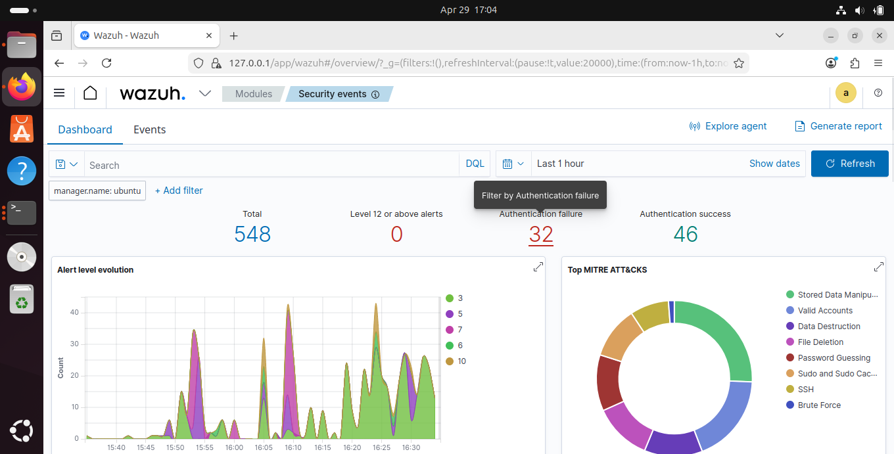
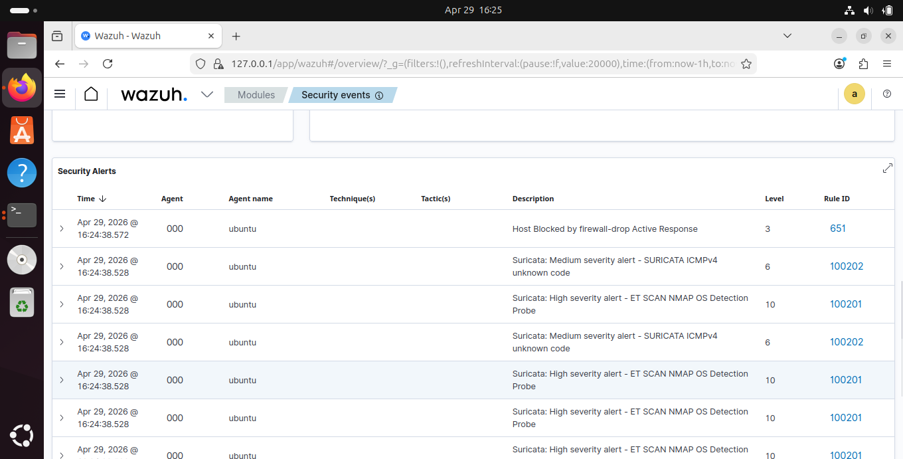
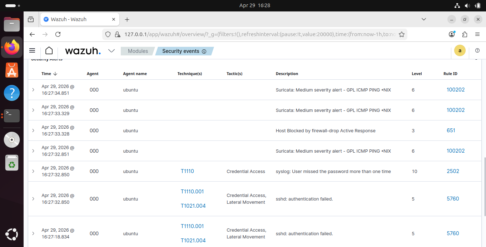
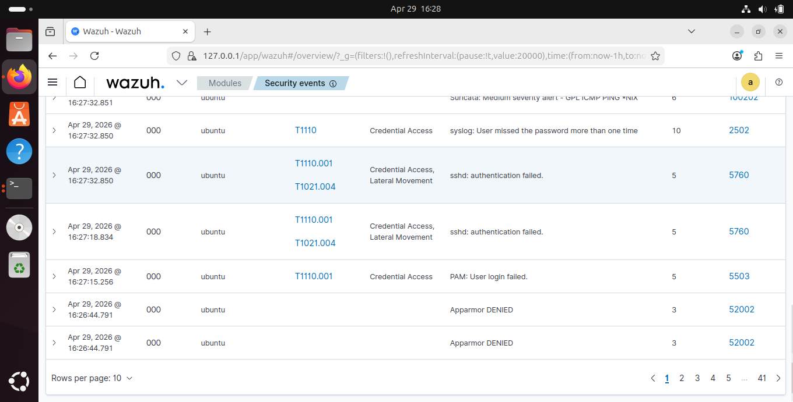
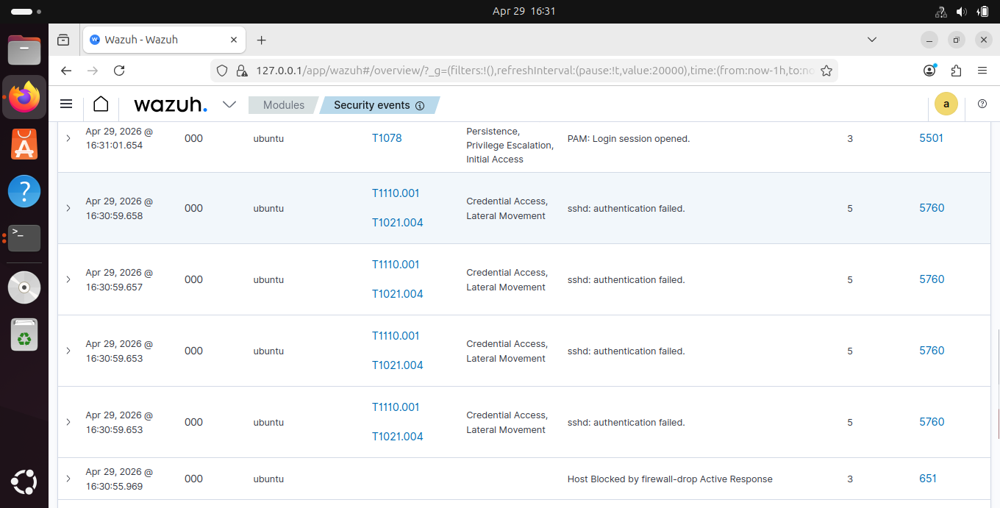
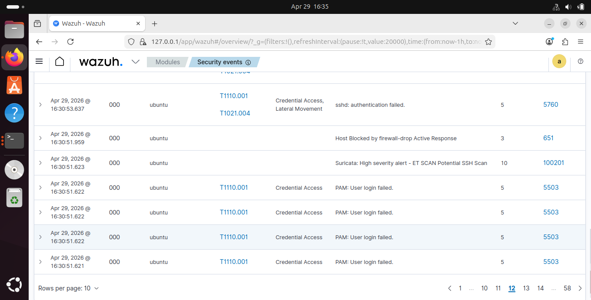

# Layered Network and Host Intrusion Detection — Suricata NIDS + Wazuh HIDS Integration


---

## Overview

This is Phase 4 of a progressive security monitoring series. The previous phases built a complete host-based detection stack using OSSEC and Wazuh across on-premise and AWS cloud environments. This phase adds the missing layer — network-level detection using Suricata NIDS running alongside Wazuh HIDS on the same Ubuntu machine.

The result is a layered security architecture where every attack is visible at two independent detection points simultaneously — the network layer as packets arrive and the host layer as the operating system responds. Both layers feed into the same Wazuh dashboard, enabling correlation across network and host events in real time.

> Phase 1 — [OSSEC Host-Based IDS](https://github.com/Emmanuel-cpp/Host-Based-Intrusion-Detection-System-HIDS-Lab-OSSEC.git)
> Phase 2 — [Wazuh On-Premise SIEM](https://github.com/Emmanuel-cpp/Wazuh-Enterprise-Security-Lab.git)
> Phase 3 — [Wazuh + AWS Hybrid SOC](https://github.com/Emmanuel-cpp/AWS-Cloud-Security-Monitoring-with-Wazuh-and-Hybrid-Endpoint-Detection)

---

## The Layered Security Architecture

Most security monitoring projects stop at one layer. Either they watch the network or they watch the host. This project implements both simultaneously and demonstrates why the combination is fundamentally more powerful than either layer alone.

```
┌─────────────────────────────────────────────────────────────────┐
│                      ATTACK SURFACE                              │
│                                                                   │
│  Kali Linux Attacker (192.168.0.50)                             │
│  Nmap scans · SSH brute force · Web scanning                    │
└───────────────────────────┬─────────────────────────────────────┘
                            │ network traffic
                            ▼
┌─────────────────────────────────────────────────────────────────┐
│               LAYER 1 — NETWORK DETECTION                        │
│                                                                   │
│  Suricata NIDS listening on enp0s9                              │
│  49,895 Emerging Threats rules loaded                           │
│  Detects: port scans, SSH probes, web attacks, protocol         │
│  anomalies at the packet level BEFORE they reach the OS         │
│                                                                   │
│  Output → /var/log/suricata/eve.json                            │
└───────────────────────────┬─────────────────────────────────────┘
                            │ packets pass through to OS
                            ▼
┌─────────────────────────────────────────────────────────────────┐
│               LAYER 2 — HOST DETECTION                           │
│                                                                   │
│  Wazuh Agent monitoring the operating system                    │
│  Watches: auth.log, syslog, PAM events, SSH daemon              │
│  Detects: authentication failures, brute force patterns,        │
│  privilege escalation, file integrity violations                │
│                                                                   │
│  Output → /var/ossec/logs/alerts/alerts.log                     │
└───────────────────────────┬─────────────────────────────────────┘
                            │ both alert streams
                            ▼
┌─────────────────────────────────────────────────────────────────┐
│               LAYER 3 — CORRELATION AND RESPONSE                 │
│                                                                   │
│  Wazuh Manager ingests both Suricata EVE JSON and host logs     │
│  Correlates network alerts with host alerts                     │
│  Maps everything to MITRE ATT&CK automatically                  │
│  Triggers active response — firewall-drop blocks attacker       │
│                                                                   │
│  Output → Wazuh Dashboard (127.0.0.1)                           │
└─────────────────────────────────────────────────────────────────┘
```

---

## Why Two Layers Are Better Than One

| Scenario | Network only | Host only | Both layers |
|---|---|---|---|
| Port scan before attack | Detected | Not visible | Detected at network |
| SSH brute force | Sees connection attempts | Sees auth failures | Both — correlated |
| Attack blocked by firewall | Sees the block | Nothing after block | Full picture |
| Legitimate admin SSH | Sees connection | Sees login success | Context for both |
| False positive assessment | Limited context | Limited context | Cross-reference both |

When Suricata fires an SSH scan alert at the network level and Wazuh fires authentication failure alerts at the host level at the same timestamp, a SOC analyst immediately has a complete picture — the attacker's IP from the network layer and the exact failure pattern from the host layer. Neither layer alone gives the full story.

---

## Environment

| Component | Details |
|---|---|
| OS | Ubuntu 24.04.4 LTS |
| Suricata | v7.x from OISF official PPA |
| Wazuh | 4.7.5 |
| Rules | Emerging Threats Open — 49,895 signatures |
| Monitored interface | enp0s9 (192.168.0.150 — bridged WiFi) |
| Attacker | Kali Linux 192.168.0.50 |
| Windows agent | 192.168.0.200 |

---

## Architecture Diagram


---

## How the Integration Works

Suricata runs in IDS mode — passive network monitoring on enp0s9. Every packet that enters or leaves the network interface is inspected against 49,895 Emerging Threats signatures. When a match is found Suricata writes a structured JSON alert to `/var/log/suricata/eve.json`.

Wazuh's logcollector reads this file continuously using the `json` log format which parses individual fields — source IP, destination IP, signature name, category, severity — directly into alert properties rather than treating the line as plain text.

Custom rules escalate alert severity based on the Suricata severity field from the Emerging Threats ruleset:

```xml
<!-- Severity 1 = Critical -->
<rule id="100200" level="12">
  <if_sid>86601</if_sid>
  <field name="alert.severity">^1$</field>
  <description>Suricata: Critical alert - $(alert.signature)</description>
</rule>

<!-- Severity 2 = High -->
<rule id="100201" level="10">
  <if_sid>86601</if_sid>
  <field name="alert.severity">^2$</field>
  <description>Suricata: High severity alert - $(alert.signature)</description>
</rule>

<!-- Severity 3 = Medium -->
<rule id="100202" level="6">
  <if_sid>86601</if_sid>
  <field name="alert.severity">^3$</field>
  <description>Suricata: Medium severity alert - $(alert.signature)</description>
</rule>
```

---

## Attack Demonstrations and Detections

### Overview Dashboard


> 548 total alerts across the attack session. 32 authentication failures. 8 MITRE ATT&CK techniques auto-mapped including Password Guessing, SSH, Brute Force, Valid Accounts, and Lateral Movement. Alert timeline showing distinct attack spikes at each stage of the attack chain.

---

### Attack 1 — Nmap Reconnaissance

Kali ran aggressive Nmap scans including SYN scan, version detection, OS fingerprinting, NULL scan, FIN scan, and XMAS scan against Ubuntu.


> Suricata detected Nmap OS fingerprinting immediately at the network layer. Rule 100201 Level 10 — ET SCAN NMAP OS Detection Probe. The network layer caught the reconnaissance before any service on Ubuntu was even touched.

---

### Attack 2 — SSH Brute Force and Dual Detection

Kali launched a full SSH credential brute force using Hydra against the SSH daemon.


> This screenshot shows the core value of layered detection. At the same timestamp Suricata fires Rule 100201 Level 10 — ET SCAN Potential SSH Scan from the network layer, while Wazuh fires Rule 2502 Level 10 — User missed password and Rule 5760 — sshd authentication failed from the host layer. Two independent detection systems. One attack. Complete visibility.


> MITRE ATT&CK techniques T1110.001 and T1021.004 mapped automatically — Credential Access and Lateral Movement classified without manual intervention.

---

### Attack 3 — Automated Active Response

After the brute force threshold was reached Wazuh's active response automatically blocked Kali's IP using iptables firewall-drop.


> Rule 651 — Host Blocked by firewall-drop Active Response. Wazuh automatically added an iptables DROP rule for Kali's IP after detecting the attack pattern. A small window of residual SSH failures appears in the seconds between Wazuh triggering the firewall-drop and iptables applying the rule — this is expected behaviour representing in-flight connections that were already established before the block took effect. In production this gap is addressed by combining active response with connection rate limiting at the network perimeter.

---

### Attack 4 — Suricata and Host Correlation


> Suricata network alert and Wazuh host alert appearing together for the same attack. The network layer provides the attacker IP and connection metadata. The host layer provides the authentication context. Combined they give the complete picture a SOC analyst needs to assess and respond to the incident.

---

## Alert Summary

| Rule | Level | Source | Description | MITRE |
|---|---|---|---|---|
| 100201 | 10 | Suricata | ET SCAN NMAP OS Detection Probe | — |
| 100201 | 10 | Suricata | ET SCAN Potential SSH Scan | — |
| 100202 | 6 | Suricata | SURICATA HTTP invalid content length | — |
| 100202 | 6 | Suricata | SURICATA ICMPv4 unknown code | — |
| 2502 | 10 | Wazuh Host | User missed password more than one time | T1110 |
| 5760 | 5 | Wazuh Host | sshd: authentication failed | T1110.001, T1021.004 |
| 5503 | 5 | Wazuh Host | PAM: User login failed | T1110.001 |
| 651 | 3 | Active Response | Host blocked by firewall-drop | — |

Total alerts generated: 548

---

## Key Finding — The Active Response Gap

One of the most instructive observations from this project was the behaviour of active response under a sustained brute force attack. After Wazuh triggered the firewall-drop rule, SSH authentication failures continued to appear in the alerts for approximately 3-5 seconds. These were not new attacks getting through — they were in-flight connections that had been established by Hydra's parallel threads before the iptables rule was applied.

This gap exists in every active response system and is a known characteristic of reactive security controls. It demonstrates why detection and blocking alone is insufficient and why network-level controls — rate limiting, connection throttling, and network-layer filtering — should be deployed in combination with host-level active response. The network layer catches the attack earlier and can terminate connections before they reach the host.

---

## Challenges and How They Were Resolved

**YAML indentation error in Suricata configuration**
Suricata's configuration file is extremely sensitive to YAML indentation. The EVE JSON output section was indented with 4 spaces instead of 6, causing the entire configuration to fail validation with the error "did not find expected '-' indicator at line 145". A Python script was used to replace the malformed block with correctly indented YAML rather than attempting manual correction in a text editor.

**HOME_NET causing zero alert events**
After installation and configuration Suricata captured traffic correctly but generated zero alert events despite 49,895 rules being loaded. The issue was that both Kali and Ubuntu were inside the HOME_NET range. Most Emerging Threats rules are written to fire only when traffic crosses the HOME_NET boundary — external attacker hitting internal host. When both endpoints are inside HOME_NET the rules do not trigger. The fix was scoping HOME_NET to only the specific IPs of trusted machines rather than entire subnets, making Kali an external attacker in Suricata's perspective.

**Binary content in eve.json causing grep failures**
After Suricata had been running for some time the eve.json file developed binary content mixed with the JSON output, causing standard grep commands to fail silently. The file was rotated by stopping Suricata, renaming the old file, and restarting to generate a fresh clean output file.

**Too many fields error in Wazuh JSON decoder**
Suricata's stats events contain over 300 JSON fields — far exceeding Wazuh's default limit of 128 fields per event. This caused repeated "Too many fields for JSON decoder" errors flooding the Wazuh log. The fix involved both removing stats and flow events from the Suricata EVE output configuration and adding suppression rules in Wazuh's local_rules.xml to silently discard any remaining stats events.

---

## What This Adds to the Security Stack

```
Phase 1 — OSSEC        Host-based detection from the raw engine
Phase 2 — Wazuh        Full SIEM with multi-agent monitoring
Phase 3 — Wazuh + AWS  Hybrid cloud and on-premise SOC
Phase 4 — This project Network layer added — complete HIDS + NIDS stack
```

Before this phase every detection capability was at the host level — logs, file integrity, authentication events. This phase adds visibility to what happens on the wire before anything reaches the host. The combination means an attacker cannot approach the network without being detected and cannot interact with the host without being detected. Both layers must be evaded simultaneously for an attack to go unnoticed — a significantly harder challenge.

---

## What Comes Next

Splunk will be the next project — ingesting Suricata EVE JSON, Wazuh alerts, Windows event logs, and Linux auth logs into Splunk and building detection dashboards and correlation searches on top of the rich data generated across all four phases of this series. The data generated in this project will serve as the foundation for Splunk's threat hunting capabilities.

---

## References

- [Suricata Documentation](https://docs.suricata.io)
- [Emerging Threats Open Ruleset](https://rules.emergingthreats.net)
- [Wazuh Suricata Integration](https://documentation.wazuh.com/current/user-manual/capabilities/log-data-collection/index.html)
- [MITRE ATT&CK Framework](https://attack.mitre.org)

---

## Author

**Emmanuel Siamoonga**
Cloud Infrastructure | Network and Cloud Security | The Copperbelt University, Kitwe, Zambia

[](https://www.linkedin.com/in/emmanuel-siamoonga-98b30929b/)
[](https://github.com/Emmanuel-cpp)

> "Defense in depth is not about adding more tools. It is about ensuring that every layer catches what the previous layer missed." 
